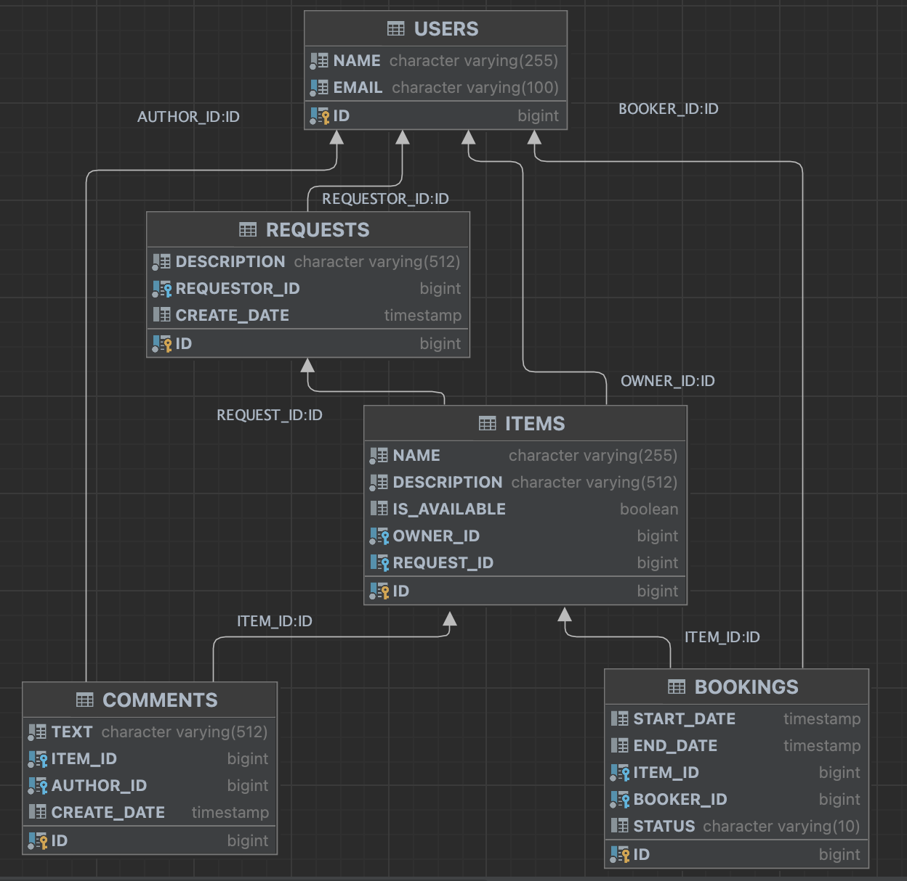

# ShareIt


### About Project
ShareIt is an educational project for developers studying at [Yandex Practicum Java Developer](https://practicum.yandex.ru/java-developer/) course.
This repository contains a backend for the sharing service.

### About Stack
Technologies were used:
+ Java
+ Spring Boot
+ Maven
+ PostgreSQL
+ Hibernate

### About Architecture
+ MSA
+ Two services: GateWay and Server

### About Functionality

+ **GateWay**  

   + service validates user requests, input DTOs and, if they valid,  redirects them to the main service for processing
+ **Server**

   + service process the core business logic of the project and CRUD-operations with entities

### About API 


Learn more information about endpoints and provided JSON - objects in project [documentation](shareIt-spec.json)

<span style="color: red;">!</span> *docs are under development, check progress [here](https://github.com/SalipA/java-shareit/blob/add-docs/shareIt-spec.json)*

### About Entity-Relationship model 




### About Run 


Use Maven for packaging and just ```docker-compose up``` it! 🐳